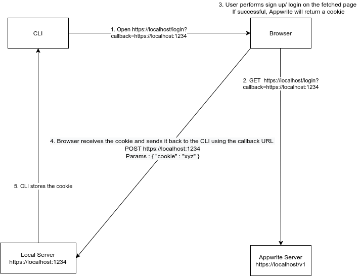

# Title <!-- What do you want to call your `awesome_feature`? -->

- Implementation Owner: @christyjacob4
- Start Date: 12-07-2021
- Target Date: (expected date of completion, dd-mm-yyyy)
- Appwrite Issue: NA

## Summary

[summary]: #summary


## Problem Statement (Step 1)

[problem-statement]: #problem-statement

**What problem are you trying to solve?**
1. We cannot create and manage projects from the CLI
2. Deploying functions is not very easy using the CLI
3. Developers find it hard to create and test cloud functions locally.


**What is the context or background in which this problem exists?**


**Once the proposal is implemented, how will the system change?**
The CLI will behave more like the console SDK and provide options to create delete and manage all your projects without leaving the CLI. 

## Design proposal (Step 2)

[design-proposal]: #design-proposal

<!--
This is the technical portion of the RFC. Explain the design in sufficient detail keeping in mind the following:

- Its interaction with other parts of the system is clear
- It is reasonably clear how the contribution would be implemented
- Dependencies on libraries, tools, projects or work that isn't yet complete
- New API routes that need to be created or modifications to the existing routes (if needed)
- Any breaking changes and ways in which we can ensure backward compatibility.
- Use Cases
- Goals
- Deliverables
- Changes to documentation
- Ways to scale the solution

Ensure that you include examples, code-snippets etc. to allow the community to understand the proposed solution. **It would be best if the examples use naming conventions that you intend to use during the actual implementation so that changes can be suggested early on during the development.**

Write your answer below.

-->


This refactor of the CLI will revolve around the following areas
1. Migration of the CLI from a Server Side SDK to a Console SDK
2. Easier deployment of Cloud Functions
3. Easier creation of Cloud Functions


## Migration of the CLI from a Server SDK to a Console SDK
---
 
Until now, the CLI was based off of our Server Side Swagger Spec. While this was a good start, it limits our functionality to a Server SDK. Ideally we want the CLI to be an alternative to the Console SDK ( aka the Appwrite Dashboard ). Here are some changes that we will need to make to adhere to the server spec.

1. Authentication

After the implementation of this RFC, the CLI will behave more like the Appwrite Console rather than a Server SDK. This accounts for a new form of Authentication that is similar to the way we handle logins in the Appwrite console. We use a cookie.

We will introduce a new command `appwrite login` that will work in one of either ways.

* `appwrite login` makes a request to the existing `accounts.createSession` endpoint, captures the returned cookie and uses this cookie in all the subsequent requests. 

    Whenever we wish to access console specific features, we can authenticate those requests using the cookie and continue to use the API Key based authentication when using the CI.

    ```sh
    $ appwrite login
    Email:
    Password:
    ```

* Second method relies on a browser based auth.

```sh
$ appwrite login

# Browser based authentication continues. After a successful login, the returned token and user ID are stored in a hidden preferences file.
```

1. The command first finds an available local port. 
2. Construct a redirect URL using the available port `https://localhost:1234`
3. Spin up a local http server listening to on the available port ( 1234 in this case )
4. Opens the browser with a request to either the local appwrite server or appwrite cloud `/login?callback=https://localhost:1234` with the redirect URL as one of the query parameters.




## Easier Deployment of cloud functions
--- 

### 🟢 Constrain deployments from current directory.

We start by removing the `--code` parameter in the `createTag` command and constrain function deployments only from the current directory. 

The refactored command will look like this 

```sh
appwrite functions createTag --functionId=[ID] --command=[COMMAND]
```

This issue will also need to be tackled as we implement this.
https://github.com/appwrite/appwrite/issues/1316

### 🟢 The `appwrite.json` File

The next improvement is going to be along the lines of an `appwrite.json` file. 

Running `appwrite init` in the current directory will initialize the current directory with attributes necessary to communicate with a particular project.

Consider this example
```sh
mkdir temp && cd temp

# Initialize the current directory with an appwrite project 
appwrite init
```

```sh
temp 
├── appwrite.json
├── FunctionOne
│   ├── .appwrite
│   ├── main.py
│   └── requirements.txt
└── FunctionTwo
    ├── index.js
    ├── node_modules
    └── package.json
```

An `appwrite.json` file will be associated with one project only whose ID will be visible in the `project` attribute. 

```json
{
    "project" : "",
    "functions": {
        "[Function ID]" : {
            "name" : "My awesome function 💪",
            "path" : "./FunctionOne",
            "command" : "python main.py",
            "runtime": "python3.9",
            // This section is useful when we allow cloud functions to be tested locally
            "environment_variables" :{
              "KEY 1" : "VALUE 1",
            }
        },

    },
    "hosting": {}
}
```

### 🟢 The `appwrite deploy` command

```sh
appwrite deploy function
[x] FunctionOne
[x] FunctionTwo
[] FunctionThree

# Create a function on the server using createFunction endpoint
# Create a new tag for this function using createTag endpoint
# Update the tag to activate it using updateTag endpoint 

appwrite deploy function --all
# Deploys all the functions specified in appwrite.json


# Future improvements
appwrite deploy site
appwrite deploy site --all 
```


## Easier creation of cloud functions
---

We will introduce an `appwrite generate` command that does the following
* Generate a function / static site template. 
* Make an entry in the `appwrite.json` file. Throw an error if the file doesn't exist.

Here are some example usages 
```sh
appwrite generate function --name="FunctionOne" --runtime=python-3.9
# Creates a folder called FunctionOne with a template for a sample python function.
temp
├── appwrite.json
└── FunctionOne
    ├── .appwrite
    ├── main.py
    └── requirements.txt


appwrite generate function --name="FunctionTwo" --runtime=node-16.0
# Creates a folder called FunctionTwo with a template for a sample node function.
temp 
├── appwrite.json
├── FunctionOne
│   ├── .appwrite
│   ├── main.py
│   └── requirements.txt
└── FunctionTwo
    ├── index.js
    ├── node_modules
    └── package.json
```

Under the hood, this command does the following
1. Clones a publicly hosted git repository and copy's a particular folder into your working directory. This will allow us to fix / modify templates without creating a new CLI release 👍 

2. Makes an entry in `appwrite.json`

```json
{
    "project" : "",
    "functions": {
        // Other functions ...
        "[Function ID]" : {
            "name" : "My awesome function 💪",
            "path" : "./FunctionOne",
            "runtime": "python-3.9",
            "environment_variables" :{
              "KEY 1" : "VALUE 1",
            }
        },

    },
    "hosting": {}
}
```

### Prior art

[prior-art]: #prior-art

<!--

Discuss prior art, both the good and the bad, in relation to this proposal. A
few examples of what this can include are:

- Does this functionality exist in other software and what experience has their
  community had?
- For other teams: What lessons can we learn from what other communities have
  done here?
- Papers: Are there any published papers or great posts that discuss this? If
  you have some relevant papers to refer to, this can serve as a more detailed
  theoretical background.

This section is intended to encourage you as an author to think about the
lessons from other software, provide readers of your RFC with a fuller picture.
If there is no prior art, that is fine - your ideas are interesting to us
whether they are brand new or if it is an adaptation from other software.

Write your answer below.
-->

This RFC is inspired by the Firebase CLI.

### Unresolved questions

[unresolved-questions]: #unresolved-questions

<!-- What parts of the design do you expect to resolve through the RFC process before this gets merged? -->

<!-- Write your answer below. -->

### Future possibilities

[future-possibilities]: #future-possibilities

<!-- This is also a good place to "dump ideas", if they are out of scope for the RFC you are writing but otherwise related. -->

Along with this refactor, there are a couple of additional improvements that can be made if time permits. 

* Rewrite the current `Parser.php` class 
* 