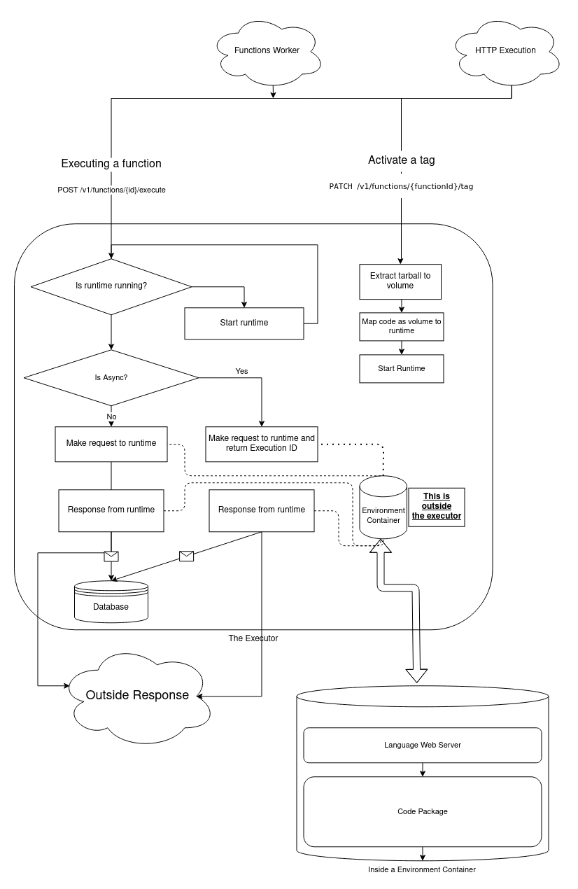

# Function Execution Model Rewrite
- Implementation Owner: @PineappleIOnic
- Start Date: 25-07-2021
- Target Date: TBD

## Summary

[summary]: #summary

<!-- Brief explanation of the proposed contribution. Write your answer below. -->
This RFC contains a proposal for rewriting Cloud Functions in a way that will enable us to perform synchronous executions. This will introduce a new server into Appwrite specifically for dealing with executions called the "executor". The executor will deal with spinning up docker containers for runtimes that are required as well as updating containers with new code when needed. When API requests for functions are received the executor will forward them to the relevant runtime which will then handle it.

## Problem Statement (Step 1)

[problem-statement]: #problem-statement

**What problem are you trying to solve?**

Cloud Functions currently do not support the ability to execute synchronous functions and will require a complete rethink to how we approach how we execute our functions in order for us to realize this goal.

**What is the context or background in which this problem exists?**

Cloud Functions are currently a bit limited, this new design idea will allow for more customizability and control of how functions will execute and run for users.

**Once the proposal is implemented, how will the system change?**

- A new process will be introduced to execute functions
- All current runtimes will be updated to use a web server as it's core
- The Functions worker will be stripped of all direct docker interactions and will instead call the executor

## Design proposal (Step 2)

[design-proposal]: #design-proposal

With this redesign of how cloud functions work the functions worker will no longer have to deal with spinning up docker containers but will instead use the executor server. Which will handle spinning up containers on behalf of the functions worker.

The executor will have multiple tasks but the main one is to spin up runtimes when they are needed and to update their code whenever functions are updated. Runtimes will now be web servers based of their relevant languages and when code is added it will be added to the Runtime web server's router.

The executor will also act like a router itself, when API Requests that are for functions are received it will be the executor's job to correlate them to the relevant runtimes and forward them for processing. When the Runtime's web server is done processing the request and returns a response the executor will return the response to whatever client requested it.

The executor will be built using a Swoole HTTP Server and will be stored in the file: `app/executor.php`. The executor will need to be on the same network as appwrite so the two can communicate.

#### API Endpoints
This rewrite will add functionality to the API endpoints that are currently used by the functions worker. The executor will take over these endpoints while the rest will stay underneath the functions worker.

`POST /v1/functions/{id}/executions/` - Execute function API endpoint

The standard execution endpoint for functions will have functionality added for syncronous executions aswell as a new parameter in the JSON body to determine if this execution will be syncronous or asyncronous, this parameter will be called `isSync` and will be a boolean.
This Endpoint will not change for normal async executions and will stay relatively the same (using the queue system).

If it's syncronous then it will execute the functions directly using the executor and return the response, returning
a error with a non 200 http code if anything goes wrong.

`PATCH /v1/functions/{id}/tag` - Update function tag API endpoint
The tag update endpoint will also recieve a small rewrite for the request moving it into the executor.

It will act like so:
1. Extract the code tarball into the enviroment.
2. also check if the runtime exists, if it doesn't then create the runtime.
3. Map the new code into the runtime environment using a volume

#### Flowchart Visualisation:

<!--
This is the technical portion of the RFC. Explain the design in sufficient detail keeping in mind the following:

- Its interaction with other parts of the system is clear
- It is reasonably clear how the contribution would be implemented
- Dependencies on libraries, tools, projects or work that isn't yet complete
- New API routes that need to be created or modifications to the existing routes (if needed)
- Any breaking changes and ways in which we can ensure backward compatibility.
- Use Cases
- Goals
- Deliverables
- Changes to documentation
- Ways to scale the solution

Ensure that you include examples, code-snippets etc. to allow the community to understand the proposed solution. **It would be best if the examples use naming conventions that you intend to use during the actual implementation so that changes can be suggested early on during the development.**

Write your answer below.

-->

#### Documentation
Documentation will need to be updated to explain how syncronous execution works and how to use it.

### Prior art

[prior-art]: #prior-art

https://docs.fission.io/docs/architecture/

### Unresolved questions

[unresolved-questions]: #unresolved-questions
 
 - Discuss monitoring health of containers
 - Discuss horizontal scaling of containers
 - Using things such as [Amazon Firecracker](https://firecracker-microvm.github.io/)
 - Will the executor handle load balencing itself or will we use another service to deal with it?

### Future possibilities

[future-possibilities]: #future-possibilities

<!-- This is also a good place to "dump ideas", if they are out of scope for the RFC you are writing but otherwise related. -->

<!-- Write your answer below. -->

