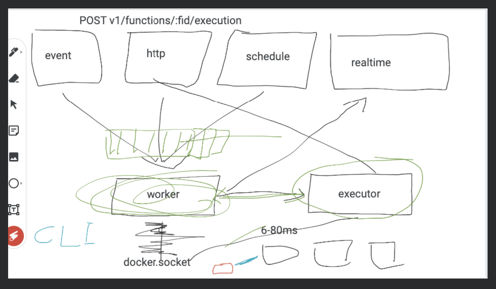

# New Functions Runtime

1. It will require web server
2. It receives path to extracted execution code files
3. entry file name / for some, entry function - set default main() - entry() - execute()
4. A signature for web server, that has request/response model
5. Wildcard endpoint, that accepts request to any endpoint
6. Handle dependencies of the function - Build step for every runtime (avoid uploading dependencies), handling conflicts
7. Prevent code execution outside of the controller endpoint
8. For statically typed langugage, as dynamic import is not possible, user code volume must be predefined and signature must be predefined
9. Timeout handling from executor, canceling Request from executor so that web server takes care of the rest

- The function should export the callback that runtime can import and pass as callback to the request

```js
on('/', callback) {
    //callback is what cloud functions should provide
}

//callback signature
callback(req, res);
```
1. Make sure request object is same in every language
   1. Headers
   2. Cookies
   3. Payload
   4. Environment variables
   5. Query Params
2. Make sure response object is same in every language
   1. send  - accept string
   2. status

3. Some kind of dependencies for each cloud functions language that has the type definitions for auto completion and type safety

Stage 1:
## Node JS
- micro/express/fastify

## Deno
- Native HTTP server

## Dart
- Shelf package

Stage 2:
## PHP
- swoole with utopia

## Python
- Flask

## Ruby
- https://dev.to/leandronsp/web-basics-a-simple-http-server-in-ruby-2jj4

Stage 3:
## Kotlin
- Spring
- Compiled

## .Net
- compiled

---

## Rust
- Compiled

## Swift
- Compiled

## GO
- native web server

## Ref
- 
- https://github.com/fission/environments