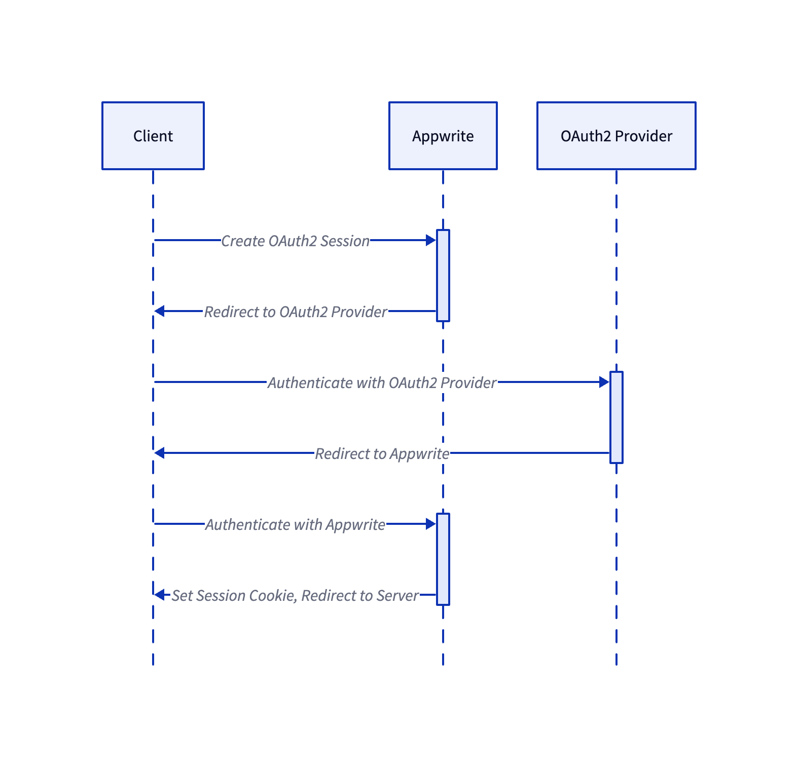
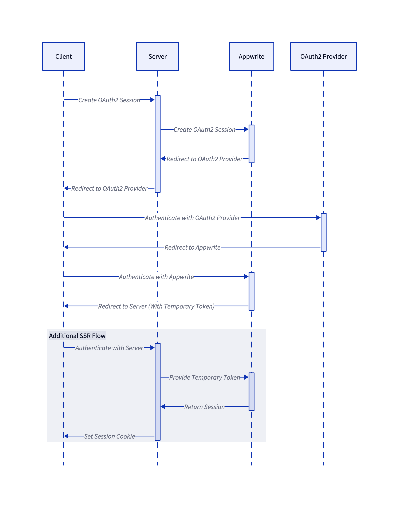

# Server Side Rendering

- Implementation Owner: @loks0n
- Start Date: 31-08-2023
- Target Date: Unknown


## Summary

[summary]: #summary

Appwrite Auth is currently tailored towards client side rendered (CSR) applications. This RFC proposes to add support for server side rendered (SSR) applications.

## Problem Statement (Step 1)

[problem-statement]: #problem-statement

**What problem are you trying to solve?**

Many popular web frameworks, such as Next.js, Nuxt.js and SvelteKit, support and recommend SSR, by default. When developers attempt to use Appwrite Auth with these frameworks, they run into issues with the current implementation.

SSR is popular for a number of reasons:

- It enables search engines to crawl the site and index the content
- It improves performance by reducing the time to first render, and reducing the amount of JavaScript required to render the page
- It improves accessibility by ensuring that the page is usable even if JavaScript is disabled
- It prevents flash of unauthenticated content.


## Design proposal (Step 2)

[design-proposal]: #design-proposal

### Issue #1: Accessing sessions

When using Appwrite basic authentication methods, such as anonymous sessions, email-password sessions, and magic URL sessions, the session secret is not accessible using the SDK.

The SDK obscures the session cookie value with the [call method](https://github.com/appwrite/sdk-for-node/blob/aaea14a36d5b7daac859eaa8dc44d2253fbcbcef/lib/client.js#L120C86-L120C86) and only returns the response body. For client-side applications, this is sufficient, because the `set-cookie` header is read by the browser, and the cookie is automatically stored in the browser's cookie storage.

A popular workaround for this is to make a manual request, bypassing the SDK and parsing the cookie from the response headers.

```js
import { parse } from "set-cookie-parser";

// Make a manual request to create an anonymous session
const response = await fetch(
  `https://cloud.appwrite.io/v1/account/sessions/anonymous`,
  {
    method: "POST",
    headers: {
      "x-appwrite-project": "PROJECT_ID",
    },
  }
);

// Parse the session cookie from the response headers
const cookies = response.headers.get("set-cookie") || "";
const sessionCookie = parse(cookies).find((cookie) =>
  cookie.name.startsWith("a_session")
);
const sessionSecret = sessionCookie?.value;
```

> SDK for Flutter bypasses this problem by adding an 'interceptor' to requests. With any response containing a `set-cookie` header, the interceptor stores the cookies within a Flutter implementation of cookie storage. Before making any request, the session cookie is retrieved from storage and added to the request headers.

#### Proposed Solution

Return the token within the session object.

Developers can then access the token like this:

```js
import { Client, Account } from "node-appwrite";

const client = new Client();
client.setEndpoint("https://cloud.appwrite.io/v1");
client.setProject("PROJECT_ID");

const account = new Account(client);
const session = await account.createAnonymousSession();
const sessionSecret = session.secret;
```


### Issue #2: Accessing OAuth2 sessions

Here's a visualisation of the current OAuth2 flow:



Step by step:

1. Client makes a 'Create OAuth2 Session' request to the Appwrite, containing the provider, and a success authentication redirect URL.
2. Appwrite returns a URL for a page to authenticate with the OAuth2 provider.
3. User is redirected to the authentication URL, and authenticates with the OAuth2 provider.
4. OAuth2 provider redirects the browser back to Appwrite.
5. Appwrite sets the session cookie on the Appwrite domain, and redirects the browser to the success URL.

This is incompatible with SSR applications, because the session cookie is set on the Appwrite domain, and not the SSR domain.

> There is an undocumented workaround for SSR. To use it, when creating an OAuth2 session, set success parameter is set to `{SSR_DOMAIN}/auth/oauth2/success`. 
> Now, Appwrite will append the session secret as a query parameter when redirecting to this URL. You can find the source code for this [here](https://github.com/appwrite/appwrite/blob/3f3d518f3664bcab281ee00b45dd2f2d387ffc72/app/controllers/api/account.php#L870).
> Although this workaround has good developer experience, it is not secure. The session secret is exposed in the URL, and can be intercepted.

#### Proposed Solution

- Add the Create OAuth2 session endpoints to the Server SDKs.
- Modify the oauth2 flow to include a temporary token in the final redirect.
- Add a new endpoint, to exchange the temporary token for a session token.

Here's a visualisation of the new flow:



Step by step:

1. Client makes a 'Create OAuth2 Session' request to the Server, containing the user specified provider.
2. Server makes a 'Create OAuth2 Session' request to Appwrite, containing the provider, and a success authentication redirect URL.
3. Appwrite returns a URL for a page to authenticate with the OAuth2 provider.
4. Server returns the authentication URL to the Client.
5. User is redirected to the authentication URL, and authenticates with the OAuth2 provider.
6. OAuth2 provider redirects the browser back to Appwrite.
7. Appwrite sets the session cookie on the Appwrite domain, and redirects the browser to the success URL, **which now includes a userId & temporary token.** e.g. `myssrapp.com/oauth2/success?userId=387asdf7rh42346&token=adfh38khjasd83j`
8. Server exchanges the temporary token for a session token, using the new exchange endpoint, and sets the session cookie on the Server domain.

The SSR application must set up the success page to call the exchange endpoint. The page can then set session cookie on the SSR domain.

##### New Exchange Token Endpoint

**PUT /v1/account/sessions/oauth/exchange** - Exchange a temporary OAuth2 token for a session token.

**Request**

| Name   | Type   | Description             |
| ------ | ------ | ----------------------- |
| token  | String | Temporary OAuth2 token. |
| userId | String | User ID.                |

**Response**

Session object.


#### Issue #3: Using session tokens

After acquiring a session token, you want to make authenticated requests. For example, getting the user's account details. Currently, to set a session token on the server-side, we have to set the `X-Fallback-Cookies` header.

```js
import { Client, Account } from "appwrite";

const client = new Client();
client.setEndpoint("https://cloud.appwrite.io/v1");
client.setProject("PROJECT_ID");

const serialisedCookies = JSON.stringify({
  a_session_PROJECT_ID: sessionSecret,
});

client.headers["X-Fallback-Cookies"] = serialisedCookies;

const account = new Account(client);
const currentUser = await account.get();
```

This is not intuitive, and requires the developer to understanding details of Appwrite that don't need to be exposed.

#### Proposed Solution

A new SDK helper method, called `setSession`, `setToken`, `setSecret`, or `setSessionSecret` to set the session token of future requests.

```js
import { Client, Account } from "appwrite";

const client = new Client();
client.setEndpoint("https://cloud.appwrite.io/v1");
client.setProject("PROJECT_ID");

client.setSession(session);

const account = new Account(client);
const currentUser = await account.get();
```

### Issue #4: Rate limiting

Many Appwrite endpoints are rate-limited by IP address to prevent abuse. For example, the Create Account endpoint is limited to 10 requests per minute. Server-side rendered applications will be making requests from the same IP address. This means that if multiple users are using the application at the same time, they will be sharing the same rate limit.

#### Proposed Solution A

Allow developers to use `setKey` and `setSession` in combination. In this case, Appwrite should will use the session token for authorization, but disable rate limiting for the request. This solution only works for Server Side SDKs, as the client-side SDKs do not have the `setKey` method.

```js
import { Client, Account } from "node-appwrite";

const client = new Client();

client.setEndpoint("https://cloud.appwrite.io/v1");
client.setProject("PROJECT_ID");
client.setKey("API_KEY");
client.setSession("SESSION_SECRET");
```

#### Proposed Solution B

Use the existing 'Platforms' configuration. Developers should be able to create a new 'Server' type platform, and which will disable rate limiting for requests made from that platform. Pontentially not secure, as the hostname can be spoofed.

### Documentation & Content

#### What **docs** would support this feature?

- SDK docs and examples for the new helper method.
- SDK docs and examples for the new token exchange endpoint.

#### What **tutorials** (text/video) might help developers understand this feature scope, capabilities, and possible use-cases?

- Generic Tutorial for using Appwrite for SSR
- Tutorial for using Appwrite and Next.js for SSR
- Tutorial for using Appwrite and Nuxt.js for SSR
- Tutorial for using Appwrite and Remix for SSR
- Tutorial for using Appwrite and SvelteKit for SSR

#### What **demo applications** can help us demonstrate this feature APIs and capabilities?

- Update Almost SSR examples.

### Prior art

[prior-art]: #prior-art

- https://supabase.com/docs/guides/auth/server-side-rendering
- https://firebase.nuxtjs.org/tutorials/ssr.html
- https://github.com/gladly-team/next-firebase-auth

### Unresolved questions

[unresolved-questions]: #unresolved-questions

**Problem #2**

2.1. Should we remove the undocumented OAuth2 SSR workaround?

2.2. Do we need to add a new endpoint to exchange the temporary token for a session token? Can we reuse the existing magic URL exchange endpoint?

**General**

4.1. Some of these changes reduce the distinction between the Server and Client Side SDKs. Which SDKs would be recommended for SSR applications?

### Future possibilities

[future-possibilities]: #future-possibilities

**OAuth2 exchange endpoint pre-built for popular frameworks**

The OAuth2 exchange endpoint can be pre-built for popular SSR frameworks, such as Next.js, Nuxt.js, SvelteKit, and Remix.

For example, in Next.js, developers could import an `oauth2ExchangeEndpoint` function from the Appwrite SDK, and use it in the success page.

```js
import { createOAuth2ExchangeEndpoint } from "appwrite/nextjs";

export const GET = createOAuth2ExchangeEndpoint('my_cookie_name');
```

**Cookie helper methods for popular frameworks**

On the web, SSR applications will need to set cookies under the SSR domain, but the cookie returned by Appwrite is set under the Appwrite domain.

Each SSR framework has an interface for setting cookies in the response.
For example, in Next.js, you can use the [setCookie](https://nextjs.org/docs/api-reference/next/cookies#setcookie) method.
SvelteKit has a [cookie](https://kit.svelte.dev/docs#modules-cookie) module.

For Next.js, the code would look like this:

```js
import { cookies } from "next/headers";

const cookieList = cookies();
cookieList.set({
  name: "my_cookie_name",
  value: session.token,
  path: "/",
  sameSite: "none",
  secure: true,
  httpOnly: true,
  maxAge: session.expire,
});
```

We can provide a helper method for popular SSR frameworks to set the cookie in the response.

```js
import { cookies } from "next/headers";
import { createSessionCookie } from "appwrite/nextjs";

const cookieList = cookies();
cookieList.set(createSessionCookie(session, "my_cookie_name"));
```

Popular JS frameworks worth including:

- Next
- SvelteKit
- Nuxt
- Remix
